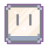

# 
  

## Our Team
 
#### Dimitar Georgiev - Scrum Trainer
#### Nikolay Zhelev - QA
#### Georgi Ivanov - Developer
#### Aleksander Popov - Developer
#### Yuan Tomov - Developer
#### Tsvetan Zhekov - Developer

## About the app

#### Our team made digital school where teachers can give homework, tasks to grade, see the students with highest/lowest grades and the average grades of a student.

##  Installation

#### *These instructions will help you copy and run our project.*

###  Compile from source

#### - Prerequisites

#### `Code Editor(e.g. Visual Studio)`   `Git`

#### - Installing

#### 1. Clone the repo

#### `https://github.com/codingburgas/E-novators`

#### 2. Open the *premake .bat* file

#### 3. Run the project

##  Documentation

####  [Documentation](posle)
####  [Presentation](posle)

##  Used Technologies

#### Used code editor & collaborative service:
#####   
#### Used tools for our overall design:
#####  
#### Used technologies for our project development:
##### 
#### Used tools for our documentation & presentation & communication:
#####   
